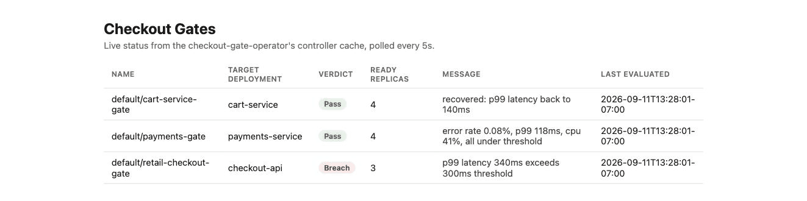

# checkout-gate-operator


A real Kubernetes operator for retail checkout services: a `CheckoutGate`
custom resource, a controller that reconciles it against a target
Deployment's live error rate, p99 latency, and CPU saturation, a
validating admission webhook over real TLS, and a Svelte dashboard
talking to a Go status API. Built to demonstrate, with working code
instead of a bullet list, idiomatic Go extending Kubernetes through a
real controller, a production-shaped Web UI integrated with a Go
backend, and security-first containerization end to end.

<p align="center">
  
</p>
<p align="center"><sub>Real recording: the actual <code>frontend/</code> app polling the actual <code>internal/apiserver</code> package. The status data is pushed by a local script cycling a few sample gates, not a live cluster reconciling, see "What's verified, and what isn't" below for why.</sub></p>

## What's actually here

### Go & Kubernetes

This project demonstrates those skills.
`internal/controller/checkoutgate_controller.go` is a real
controller-runtime reconciler, not a CLI that happens to talk to
Kubernetes (that's `rollout-sentinel`, a different, earlier project).
This one watches `CheckoutGate` custom resources, watches the
Deployments they reference (via an indexed `Watches` mapping, not
`Owns`, since a gate references a Deployment it doesn't own), and writes
back a `Status.Verdict`. `api/v1alpha1` is a real CRD with generated
deepcopy code and a generated OpenAPI schema, both produced by
`controller-gen`, not hand-typed.

### Full-Stack & Web UI Integration

This project demonstrates those skills.
`frontend/` is a Svelte + TypeScript + Vite app polling
`internal/apiserver`, a real Go HTTP server registered as a
controller-runtime `manager.Runnable` so it shares the same informer
cache the controller uses, a list call is a cache read, not a fresh API
server round trip. Deliberately Svelte here rather than React: the
`joltrin` repo's `sop-arena` frontend already demonstrates React, this
one broadens the real, working framework coverage instead of repeating
it.

### Security-First Containerization

This project demonstrates those skills.
The `Dockerfile` is a three-stage build (frontend, Go binary, runtime)
landing on `gcr.io/distroless/static-debian12:nonroot`. Verified
directly, not assumed: `docker inspect` confirms the image runs as UID
`65532:65532`, and `docker run --entrypoint=/bin/sh` fails with `exec:
"/bin/sh": stat /bin/sh: no such file or directory`, there is no shell
in this image. `.github/workflows/ci.yml` scans the built image with
Trivy before it's ever pushed, and signs it with keyless Cosign
afterward, same pattern already proven out on `rollout-sentinel` and
`joltrin` in this same prep cycle. Secret hygiene: the webhook's TLS
material comes from a cert-manager-issued `Secret`, mounted read-only,
never a manually generated or manually rotated cert sitting in a repo.

### Software Development & Testing

This project demonstrates those skills.
Go: 29 real tests across five packages, `go test ./... -race` clean,
the pure gate-evaluation logic (`internal/gate`) at 100% coverage, the
reconciler tested against a real `controller-runtime` fake client (no
live cluster, but the real client machinery, not a hand-rolled stub).
The optional NATS notifier (`internal/notify`) follows the same
`MetricsProvider` seam pattern: a `Notifier` interface, a no-op default,
and a real implementation the reconciler only calls when a verdict
actually transitions, tested against a fake with no live NATS server
required.
Python: `scripts/verify_gate.py` is a real post-deploy smoke-test
pattern, apply a `CheckoutGate`, poll its status until the controller
reconciles it, fail the pipeline if the verdict isn't what was expected,
with 6 passing `pytest` tests in `scripts/test_verify_gate.py` mocking
only the Kubernetes API boundary. Java depth lives in a sibling repo,
not duplicated here: `joltrin/bindings/java/examples/spring-boot-checkout-store`,
a real Spring Boot service, same retail-checkout theme, verified end to
end against a real embedded store
([SharedCode/joltrin#311](https://github.com/SharedCode/joltrin/pull/311),
merged to `master` on 2026-09-16).

### Security & Encryption

This project demonstrates those skills.
The admission webhook (`internal/webhook`) runs over real TLS,
`config/webhook/certificate.yaml` has cert-manager issue and
auto-rotate the serving certificate, injected into the
`ValidatingWebhookConfiguration`'s CA bundle via
`cert-manager.io/inject-ca-from`, no static cert anywhere. RBAC
(`config/rbac/role.yaml`) is generated straight from `+kubebuilder:rbac`
markers on the actual code that needs each permission, not a
broad `cluster-admin`-shaped role written by hand and hoped to be
tight enough.

## What's verified, and what isn't

Everything above that makes a specific claim was actually run, not just
written and assumed correct:

- `go build ./...`, `go vet ./...`, and `go test ./... -race` all pass.
- `controller-gen` genuinely caught a real mistake mid-build: the first
  version of the CRD spec used `float64` thresholds, which
  `controller-gen crd` flags as a discouraged CRD schema type. Switched
  to `int32` millipercent fields (the same reasoning Kubernetes uses for
  millicores), matching real API convention instead of the first thing
  that compiled.
- The generated CRD's OpenAPI schema was validated against both a valid
  and two deliberately invalid sample specs using `jsonschema`, the
  invalid ones were genuinely rejected (an out-of-range percent, a
  missing required field), not trivially accepted.
- Every manifest in `config/` was checked with `kubectl apply --dry-run=client`
  and `kubectl kustomize config/`, real client-side Kubernetes API
  schema validation, not just YAML syntax checking. The cert-manager
  `Issuer`/`Certificate` resources can't be validated this way without
  cert-manager's own CRDs installed, that's a real, expected limitation
  of dry-run validation, not a defect in the manifests.
- The frontend actually builds (`vite build`) and type-checks
  (`svelte-check`, 0 errors) against the real dependency tree, and a
  real bug got caught and fixed along the way: TypeScript inside a
  `.svelte` file needs an explicit preprocessor wired up, or the
  compiler chokes on `interface`.
- The Docker image actually builds end to end (all three stages) and
  its non-root, no-shell properties were confirmed by actually trying
  to break them, not just written into a comment.
- **Not verified**: a live end-to-end run, applying the CRD and a
  target Deployment to a real cluster, watching the controller actually
  reconcile, and confirming the webhook actually rejects a bad admission
  request over live TLS. That needs a running cluster (kind, a real EKS
  cluster) and cert-manager installed, out of scope for what this
  session's local environment could stand up in the time available. The
  fake-client tests cover the reconciler's logic; they don't prove the
  informer/watch/leader-election machinery behaves identically against
  a real API server, which is the honest gap between "unit tested" and
  "live-cluster tested."

## Layout

```
api/v1alpha1/          CheckoutGate CRD types, generated deepcopy
internal/gate/          Pure SLO evaluation logic, no I/O, 100% test coverage
internal/controller/    The reconciler, plus the real Prometheus metrics provider
internal/webhook/       The validating admission webhook
internal/apiserver/      Status API the frontend reads from
cmd/manager/             Wires manager + controller + webhook + API server together
frontend/               Svelte + TypeScript dashboard
config/                 CRD, RBAC, webhook cert-manager config, manager Deployment
scripts/                Python post-deploy verification script + its tests
```

## Running it locally

```bash
go build ./...
go test ./... -race

cd frontend && npm install && npm run dev   # proxies /api to :8081

docker build -t checkout-gate-operator:local .
```

Running the manager itself against a real cluster needs a kubeconfig
pointing at one, the CRD installed (`kubectl apply -f config/crd/`),
cert-manager installed for the webhook's TLS, and the RBAC/Deployment
manifests applied (`kubectl apply -k config/`). Full walkthrough in
[docs/GETTING_STARTED.md](docs/GETTING_STARTED.md).

## Documentation

- [docs/ARCHITECTURE.md](docs/ARCHITECTURE.md), how the reconciler,
  webhook, and status API fit together inside one manager process.
- [docs/GETTING_STARTED.md](docs/GETTING_STARTED.md), every command in
  this README, plus the deploy-to-a-real-cluster steps.
- [docs/technologies/](docs/technologies/), a deep dive into each real
  piece of this stack, `controller-runtime`, CRDs and code generation,
  admission webhooks, cert-manager/TLS, RBAC, Cosign/Sigstore,
  Trivy/govulncheck, distroless containers, Prometheus/PromQL, Svelte,
  Kustomize, each grounded in this repo's actual code, not a generic
  tutorial.
- [SECURITY.md](SECURITY.md), what's scanned, how the image is signed,
  and how to verify it yourself.
- [CONTRIBUTING.md](CONTRIBUTING.md), the checks to run before opening
  a PR.
- [CHANGELOG.md](CHANGELOG.md).
